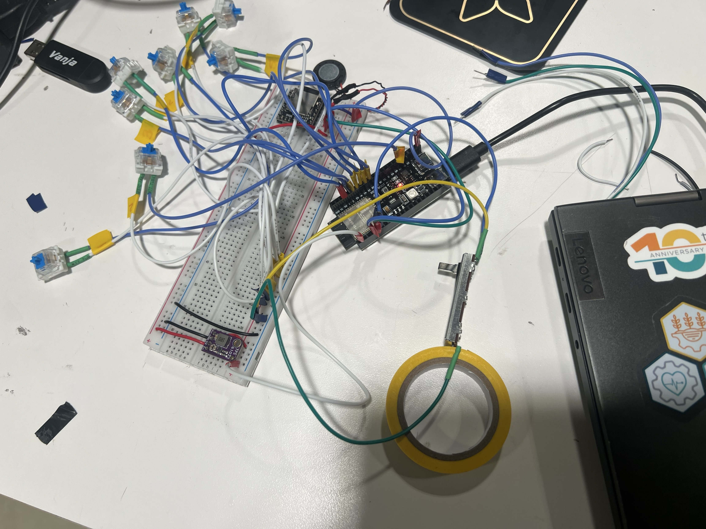

# Vocal Keys: A Human Voice Sampled Piano
A custom electronic keyboard that transforms human voices into musical instruments. 
Each key triggers a recorded .mp3 vocal sample mapped to a musical note, creating a personalized piano experience.

## Demo
https://github.com/user-attachments/assets/fc9145c8-f060-4a9d-a129-25b0cc0f393c

## Features
- 12-key electronic keyboard
- Human voice samples
- Dual DFPlayer Mini modules for polyphonic playback
- Adjustable volume control
- Custom 3D printed enclosure

## Materials
> ESP32 S3 Dev Board *1  
> Mechanical keys *12  
> DFPlayer Mini *2  
> SD card *2  
> 4 ohm 3W speaker *2  
> B10k potentiometer slider *1
> TPS 61023 voltage boost converter *1  
> // DFPlayer needs 5V input, so a level shifter is needed for converting ESP32 3V3 output to 5V

## Form Factor

## Wiring
DFPlayer1 TX - ESP32 GPIO 5  
DFPlayer2 RX - ESP32 GPIO 4

DFPlayer2 TX - ESP32 GPIO 16
DFPlayer2 RX - ESP32 GPIO 15

Slider pin 1 - 3V3
Slider pin 2 - ESP32 GPIO 6

Voltage converter Vin - ESP32 3V3 output
Voltage converter Vout - DFPlayer Vin (5V)

the 12 keys positive - 3V3
the 12 Keys negative - ESP32 GPIO 1, 2, 42, 41, 40, 39, 38, 47, 9, 10, 11, 12  
// Note that some GPIOs on ESP32 S3 are used for special purposes like reset and are not safe to use as button inputs

  
// This image only includes some buttons and one DFPlayer, just for reference
